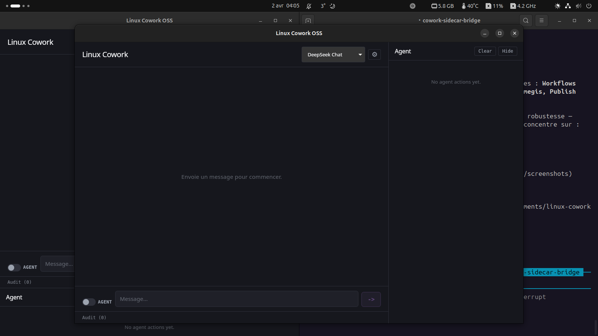

# Linux Cowork OSS

**An open-source, Linux-first AI desktop assistant with computer use, multi-model support, and agent orchestration.**

[](LICENSE)
[](#)
[](#)
[](https://bun.sh)

---



## What is this?

Linux Cowork OSS is a free, open-source alternative to Anthropic's Computer Use / Cowork for Linux desktops. It lets an AI see your screen, click, type, manage files, and run shell commands -- all locally. It supports multiple LLM providers (DeepSeek, Claude, Ollama) so you're never locked into one vendor. The entire stack runs on your machine with no cloud dependency required.

Built with Tauri v2 + React + Bun. Lightweight (~5MB binary), fast, and privacy-first.

## Features

- **18 Built-in Tools** -- bash, file read/write, screenshot, mouse/keyboard, window management, and more
- **Computer Use** -- AI sees your screen and interacts with it (xdotool + gnome-screenshot)
- **Multi-Model Router** -- DeepSeek (default), Claude, Kimi, Grok, Ollama local -- switch on the fly
- **Agent Orchestration** -- spawn parallel sub-agents, status tracking, kill controls
- **Persistent Memory** -- SQLite-backed conversation history + agent memory across sessions
- **Autonomous Mode** -- POST a goal, the agent loops tools until done (max 25 iterations)
- **Vision Loop** -- continuous screenshot monitoring every 2 seconds
- **MCP Protocol** -- Model Context Protocol client for extensible tool connections
- **Skills & Plugins** -- extensible skill system with hooks
- **Sandbox Security** -- bubblewrap (bwrap) sandboxing + permission system + audit trail
- **Undo System** -- rollback any agent action from the UI
- **Desktop Notifications** -- notify-send integration
- **LAN Remote Access** -- control from your phone on the same network
- **Settings UI** -- configure API keys, model, temperature from the app
- **Dark Theme** -- clean, modern interface
- **.deb Package** -- installable on Debian/Ubuntu

## Quick Start

```bash
git clone https://github.com/YOUR_USERNAME/linux-cowork-oss.git
cd linux-cowork-oss/app
bun install
bun run dev
```

The backend (Hono on port 3001) starts automatically with the frontend.

> **Prerequisites:** [Bun](https://bun.sh) runtime, Linux with X11 or Wayland, `xdotool` and `gnome-screenshot` (or `scrot`) for computer use.

## Models Supported

| Provider | Model | Cost | Notes |
|----------|-------|------|-------|
| DeepSeek | deepseek-chat | ~$0.14/M tokens | Default. Fast, cheap, good quality |
| Anthropic | Claude 3.5/4 | ~$3-15/M tokens | Best reasoning, needs API key |
| Ollama | llama3.2:1b+ | Free (local) | Zero cloud, runs on CPU |
| Moonshot | Kimi K2.5 | ~$0.50/M tokens | Alternative router option |
| xAI | Grok | ~$2/M tokens | Fast fallback |

Bring your own API keys. Or run 100% local with Ollama for $0.

## Architecture

```
┌─────────────────────────────────────────┐
│           Tauri Desktop App (Rust)       │
│  ┌─────────────────────────────────┐    │
│  │     React 19 + Vite + Zustand   │    │
│  └──────────────┬──────────────────┘    │
│                 │ HTTP/SSE                │
│  ┌──────────────┴──────────────────┐    │
│  │       Hono Backend (Bun)         │    │
│  │                                  │    │
│  │  ┌──────────┐ ┌──────────────┐  │    │
│  │  │ Tool-Use │ │ Multi-Model  │  │    │
│  │  │ Loop     │ │ Router       │  │    │
│  │  └──────────┘ └──────────────┘  │    │
│  │  ┌──────────┐ ┌──────────────┐  │    │
│  │  │ Computer │ │ Agent        │  │    │
│  │  │ Use      │ │ Orchestrator │  │    │
│  │  └──────────┘ └──────────────┘  │    │
│  │  ┌──────────┐ ┌──────────────┐  │    │
│  │  │ MCP      │ │ Skills +     │  │    │
│  │  │ Client   │ │ Hooks        │  │    │
│  │  └──────────┘ └──────────────┘  │    │
│  │  ┌──────────────────────────┐   │    │
│  │  │ SQLite · bwrap sandbox   │   │    │
│  │  │ permissions · audit log  │   │    │
│  │  └──────────────────────────┘   │    │
│  └──────────────────────────────────┘    │
└─────────────────────────────────────────┘
```

**Stack:** Tauri v2 (Rust) / React 19 / Vite 8 / Bun / Hono / SQLite / Vitest / Biome

## Comparison

| Feature | Anthropic Cowork | Linux Cowork OSS |
|---------|-----------------|------------------|
| Price | $200/month | Free (open-source) |
| Linux support | No | Yes (Linux-first) |
| Computer Use | Yes | Yes (18 tools) |
| Multi-model | Claude only | DeepSeek, Claude, Ollama, Grok, Kimi |
| Local/offline | No | Yes (Ollama) |
| Memory persistence | Limited | SQLite + file-based |
| Agent orchestration | Single agent | Multi-agent with parallel spawn |
| Sandbox | Yes | Yes (bwrap) |
| Undo/rollback | Limited | Built-in undo system |
| Open-source | No | MIT License |

## Current Status

This is an active early-stage project. Sprint 1 is complete with 308 passing tests and a working .deb package.

**What works well:** chat, tool use, computer use, autonomous mode, multi-model routing, memory, agent spawning, LAN access.

**Known limitations:**
- X11 computer use is more reliable than Wayland (xdotool vs ydotool)
- Vision models depend on your LLM provider supporting image input
- No Windows/macOS support (Linux-only by design)
- UI is functional but still being polished

See [PROGRESS.md](PROGRESS.md) for detailed status.

## Project Structure

```
linux-cowork-oss/
├── app/                    # Main application
│   ├── src/
│   │   ├── components/     # React UI components
│   │   ├── core/           # Engine, models, computer-use, agents, MCP
│   │   ├── backend/        # Hono HTTP server
│   │   ├── stores/         # Zustand state management
│   │   └── api/            # API client layer
│   ├── src-tauri/          # Tauri/Rust backend
│   └── tests/              # Vitest test suite (308 tests)
├── docs/                   # Architecture documentation
├── screenshots/            # UI screenshots
├── scripts/                # Build and utility scripts
└── LICENSE                 # MIT
```

## Contributing

Contributions are welcome. This project is early-stage, so there's plenty to do.

1. Fork the repo
2. Create a feature branch (`git checkout -b feature/my-feature`)
3. Make your changes and add tests
4. Run `bun test` and `bun run build` to verify
5. Submit a pull request

Please open an issue first for large changes so we can discuss the approach.

## License

[MIT License](LICENSE) -- Copyright (c) 2026 Ethernity Solution (Fabrice Steriti)

---

**Disclaimer:** This project is not affiliated with, endorsed by, or maintained by Anthropic. It is an independent, clean-room implementation. No proprietary source code has been copied.
